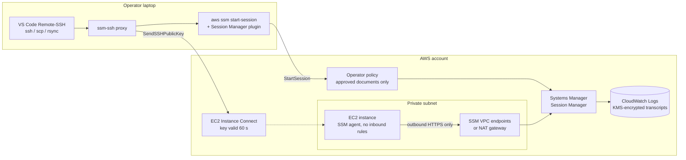
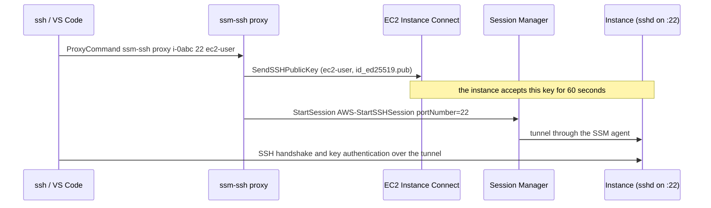

# ssm-access

**Keyless access to EC2 instances with AWS Systems Manager Session Manager: no inbound SSH, no bastion keys, every session encrypted and recorded. Includes SSH over SSM for VS Code Remote-SSH, with keys the instance accepts for 60 seconds.**

Part of [aws-security-toolkit](https://github.com/simar-s2/aws-security-toolkit).


*`ssm-ssh` writes an ssh config block, `ssh` parses it, then the module's Terraform tests run against a mocked provider. Recorded in a scratch HOME against a fake AWS CLI (`make demo`), so it needs no AWS account and doesn't touch your `~/.ssh`.*

## What it does

- **Instances with no open ports.** Security groups have no inbound rules and instances need no public IP. The SSM agent on each instance makes an outbound HTTPS connection to Systems Manager, and sessions run over it.
- **Encrypted, recorded sessions.** Account-wide Session Manager preferences encrypt every session with a KMS key and stream the transcript to an encrypted CloudWatch Logs group (optionally also to S3 in a log-archive account), with idle and maximum session timeouts.
- **Least-privilege operator policy.** People can start shells, SSH over SSM and port forwarding only through the approved session documents, can only end their own sessions, and can optionally be limited to instances tagged `ssm-access=<team>`.
- **SSH for tools that need it.** `ssm-ssh` makes `ssh`, `scp`, `rsync` and VS Code Remote-SSH work through Session Manager. Each connection pushes your public key with EC2 Instance Connect, the instance accepts it for 60 seconds, and nothing is written to `authorized_keys`.
- **Instances managed without instance profiles (optional).** Default Host Management Configuration makes every EC2 instance with IMDSv2 SSM-managed automatically, which also gives [org-patch-manager](https://github.com/simar-s2/org-patch-manager) full coverage.
- **Submodules** for SSM VPC endpoints (private subnets with no NAT gateway) and a private, IMDSv2-only jump host.

**Tech:** Terraform (AWS provider 6), CloudFormation, AWS Systems Manager Session Manager, EC2 Instance Connect, KMS, CloudWatch Logs, Bash, pytest, GitHub Actions.

## Architecture



One SSH connection through `ssm-ssh`:



## Quick start

### Deploy with Terraform

```hcl
module "ssm_access" {
  source = "git::https://github.com/simar-s2/ssm-access.git?ref=v0.1.0"

  enable_default_host_management = true            # optional, account-wide
}

resource "aws_iam_role_policy_attachment" "operators" {
  role       = "my-sso-or-team-role"
  policy_arn = module.ssm_access.operator_policy_arn
}
```

For a private subnet without a NAT gateway, add the endpoints and a jump host (full version in [examples/private-vpc](examples/private-vpc)):

```hcl
module "endpoints" {
  source     = "git::https://github.com/simar-s2/ssm-access.git//modules/vpc-endpoints?ref=v0.1.0"
  vpc_id     = "vpc-0123456789abcdef0"
  subnet_ids = ["subnet-0aaa...", "subnet-0bbb..."]
}

module "jump_host" {
  source                = "git::https://github.com/simar-s2/ssm-access.git//modules/jump-host?ref=v0.1.0"
  vpc_id                = "vpc-0123456789abcdef0"
  subnet_id             = "subnet-0aaa..."
  instance_profile_name = module.ssm_access.instance_profile_name
  allow_internet_https  = false
}
```

If someone has already saved Session Manager preferences in the console, import the document first: `terraform import 'module.ssm_access.aws_ssm_document.preferences["us-east-1"]' SSM-SessionManagerRunShell`.

### Or deploy with CloudFormation

```bash
git clone https://github.com/simar-s2/ssm-access && cd ssm-access
scripts/deploy.sh --profile my-account --regions us-east-1,us-west-2 \
  --param EnableDefaultHostManagement=true
```

### Connect

You need the AWS CLI v2 and the [Session Manager plugin](https://docs.aws.amazon.com/systems-manager/latest/userguide/session-manager-working-with-install-plugin.html).

```bash
# A shell
aws ssm start-session --target i-0123456789abcdef0

# A database in the VPC on localhost:5432, through the jump host
aws ssm start-session --target i-0123456789abcdef0 \
  --document-name AWS-StartPortForwardingSessionToRemoteHost \
  --parameters host=mydb.cluster-abc.us-east-1.rds.amazonaws.com,portNumber=5432,localPortNumber=5432
```

### SSH and VS Code

```bash
install -m 755 bin/ssm-ssh ~/.local/bin/
ssm-ssh config dev-box i-0123456789abcdef0 --profile dev >> ~/.ssh/config   # or a Name tag instead of the ID
ssh dev-box
```

In VS Code, run **Remote-SSH: Connect to Host** and pick `dev-box`. `scp` and `rsync` work the same way. The instance needs `ec2-instance-connect` (preinstalled on Amazon Linux 2023 and Ubuntu 20.04+).

## Configuration

### Terraform inputs

| Name | Type | Default | Description |
|---|---|---|---|
| `name_prefix` | `string` | `sec` | Prefix for role, policy, key and log group names |
| `regions` | `list(string)` | `[]` (provider region) | Regions to configure Session Manager in |
| `session_idle_timeout_minutes` | `number` | `20` | Idle sessions close after this |
| `session_max_duration_minutes` | `number` | `480` | Hard limit on session length |
| `run_as_user` | `string` | `null` (ssm-user) | OS user sessions run as |
| `session_log_retention_days` | `number` | `365` | CloudWatch retention for transcripts |
| `session_log_bucket_name` | `string` | `null` | Also write transcripts to this S3 bucket |
| `manage_session_preferences` | `bool` | `true` | Manage the `SSM-SessionManagerRunShell` document |
| `session_access_tag_values` | `list(string)` | `[]` (all instances) | Limit operators to instances whose `ssm-access` tag has one of these values |
| `ssh_os_users` | `list(string)` | `["ec2-user", "ubuntu"]` | OS users operators may push SSH keys for |
| `enable_default_host_management` | `bool` | `false` | Default Host Management Configuration |

### Terraform outputs

| Name | Description |
|---|---|
| `instance_profile_name`, `instance_role_arn` | Attach to instances (not needed with DHMC) |
| `operator_policy_arn` | Attach to the people who connect |
| `session_kms_key_arns` | Session key per region |
| `session_log_group_name` | Where transcripts go |

### Submodules

| Module | Inputs | Outputs |
|---|---|---|
| [vpc-endpoints](modules/vpc-endpoints) | `vpc_id`, `subnet_ids`, `allowed_cidr_blocks` (VPC CIDR), `services` (ssm, ssmmessages, ec2messages, logs, kms), `name_prefix` | `endpoint_ids`, `security_group_id` |
| [jump-host](modules/jump-host) | `vpc_id`, `subnet_id`, `instance_profile_name`, `instance_type` (`t4g.micro`), `architecture` (`arm64`), `root_volume_gb` (16), `allow_internet_https` (true), `patch_reboot` (`if-needed`), `name`, `tags` | `instance_id`, `security_group_id` |

### CloudFormation parameters

`HomeRegion`, `NamePrefix`, `SessionIdleTimeoutMinutes`, `SessionMaxDurationMinutes`, `SessionLogRetentionDays`, `RunAsUser`, `ManageSessionPreferences`, `EnableDefaultHostManagement`, `SshOsUsers`, `SessionAccessTagValues`. The deploy script sets `HomeRegion` to the first region; pass the rest with `--param Key=Value`.

## Cost

Session Manager, EC2 Instance Connect and Default Host Management Configuration are free. What you pay for:

- **KMS:** one key per region (about $1 per month) plus requests.
- **CloudWatch Logs:** ingestion and storage of session transcripts, usually small.
- **VPC interface endpoints**, only if you use the submodule: each endpoint is billed per hour per Availability Zone (about $7 per month each in us-east-1) plus data processed. Five endpoints in two AZs is roughly $70 per month, so drop `logs` and `kms` from `services` if the subnet already has a NAT gateway for those.
- **Jump host**, only if you use the submodule: a `t4g.micro` and a 16 GB gp3 volume.

## Design notes

- **No inbound path to attack.** There's no port 22 to scan and no bastion to patch; access is an IAM decision that CloudTrail records, and the transcript is in CloudWatch.
- **`ssm:SessionDocumentAccessCheck`.** Without it, a caller can omit the document name and fall back to the default shell document. With it, every session must use a document the policy lists, so the encryption and logging preferences can't be bypassed.
- **60-second keys instead of managed keys.** The private key never leaves the laptop, and the instance holds the public key only long enough for one login. There's nothing to rotate or revoke on the instance, and removing someone's IAM access removes their SSH access.
- **A fixed `ssm-access` tag.** CloudFormation can't build an IAM condition key from a parameter, so both deploy paths use the same fixed key, with the allowed values configurable.
- **DHMC is opt-in.** It changes how every instance in the account and region is managed, so it should be a deliberate choice. Its role gets the same session-logging permissions as the instance profile, so logging works either way.
- **The jump host is disposable.** Private subnet, no inbound rules, IMDSv2 with a hop limit of 1, encrypted root volume, and the `patch-reboot` tag so [org-patch-manager](https://github.com/simar-s2/org-patch-manager) patches it nightly.

## Project layout

```
main.tf, operators.tf, ...   root module: role, profile, preferences, keys, logs, operator policy
modules/vpc-endpoints/       SSM endpoints for subnets without NAT
modules/jump-host/           private AL2023 host reachable only through Session Manager
bin/ssm-ssh                  SSH over SSM client (ProxyCommand and config generator)
cloudformation/              the same setup as one template
scripts/deploy.sh            one-command CloudFormation deploy
scripts/demo.sh              the recording above
examples/                    Terraform examples
tests/                       pytest (ssm-ssh, deploy script) and terraform test
```

## Development

```bash
make test    # pytest and terraform test in every module; nothing calls AWS
make lint    # terraform fmt/validate, tflint, cfn-lint, checkov, shellcheck
make demo    # the recording above
```

## License

[MIT](LICENSE)
